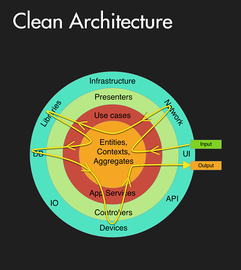
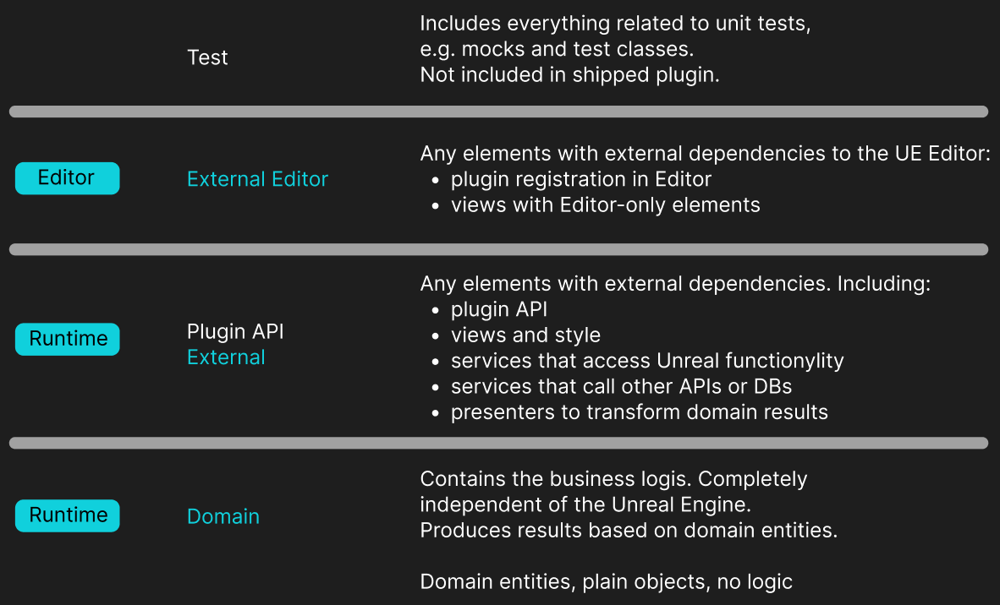
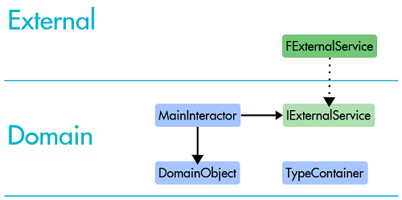
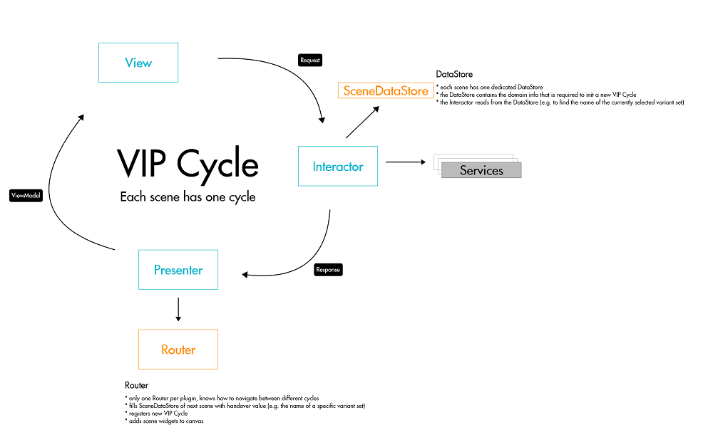
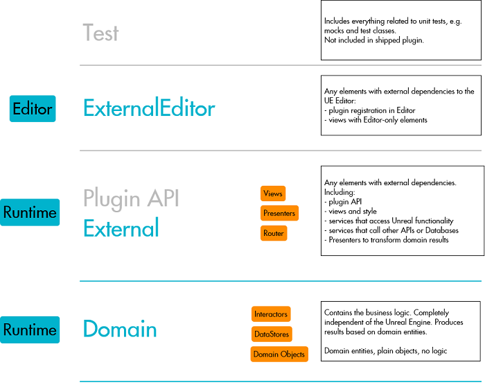

# UE Plug-in Architecture
This architecture should inspire developers to have a similar structural setup in Unreal Engine plug-ins that encourages good practices and enables testability.
The following information is meant to serve as a Getting Started and How-To.

## Clean Architecture
The term "Clean Architecture" describes a family of software architectures that all follow the same underlying principles.
It was coined by Robert C. Martin in a [blog post](https://blog.cleancoder.com/uncle-bob/2012/08/13/the-clean-architecture.html).

The main idea is to separate the software into layers, consisting of at least one layer for the business logic and one for components that have dependencies to other systems.
Outer layers contain for example UI, databases or access to external services over a network.



The overriding rule that makes this architecture work is The Dependency Rule. This rule says that source code dependencies can only point inwards. Nothing in an inner circle can know anything at all about something in an outer circle. In particular, the name of something declared in an outer circle must not be mentioned by the code in the an inner circle. That includes, functions, classes. variables, or any other named software entity.

Also, data formats used in an outer circle should not be used by an inner circle, especially if those formats are influenced by an external system in an outer circle. Nothing from an outer circle should impact the inner circles.

### Clean Architecture in UE Plug-ins
In plug-ins we create an Unreal module for each layer. The typical plug-in will have four modules which represent three distinct layers of the Clean Architecture:

- Test
- ExternalEditor
- External
- Domain



<span style="color:red">! Important !</span>
The Domain layer contains only the data objects and the business logic and will consequently only have a dependency of the Unreal "Core" module. If you feel the need to add another dependency, it's very likely that your layers are not cleanly separated.

### Inversion of Control / Dependency Injection
How can our business logic define our domain rules if the flow of our code is always inwards (the Dependency Rule)?</b>
For this, we rely on the principle of **Dependency Injection** (as an application of the concept of Inversion of Control).

We define the interface contracts that are required by the business logic in the Domain layer. The actual implementation is part of the External layer and is bound to the interface.




These bindings are registered in a TTypeContainer at module startup:
```c++
// Register instance
TTypeContainer<> Container;
Container.RegisterClass<INetworkService, ConcreteServiceImplementation>(ETypeContainerScope::Process);

// Retrieve instance
INetworkService Instance = Container.GetInstance<INetworkService>();
```

The TTypeContainer offers two important ways to bind an interface:

- instance-scoped: each requester will get a fresh instance of the bound implementation
- process-scoped: each requester will get the same instance (aka singleton)


## VIP Cycles
On top of the Clean Architecture, the plug-ins use the VIP Cycle pattern for the UI interaction.

A VIP cycle always consists of a **View**, an **Interactor** and a **Presenter**. These components have the following responsiblities:

* View: represents the user interface of a scene.
* Interactor: defines the business logic; works only with domain objects
* Presenter: transforms the given domain object result into a viewmodel that is tailored to the View

An interaction in the View triggers a request to the Interactor. The Interactor process the request and performs the required business logic, accessing services if needed.
The result is then forwarded to the Presenter as a response, which gets transformed into a viewmodel and handed back to the view.



A plug-in is usually divided into multiple scenes. Each scene has an underlying VIP cycle and offers several use-cases. Let's say a list of items and details panel for each item.

The VIP pattern fits nicely into the layers of the Clean Architecture: Interactors define the business logic and are as such part of the Domain layer. 
The View and the Presenter are linked to the plug-in's UI and are placed in the External module.



### VIP Cycle Extensions
There are two more important components in this plug-ins: the **SceneRouter** and the **DataStores**.<br/>
The **SceneRouter** is responsible to navigate between different scenes of the plug-in. A typical use-case is the selection of an item in an overview scene. The Router knows the steps to show the details of the selected item in a different scene. For that, the Router will usually create or tear down VIP cycle instances and fill **DataStores** with information.
A cycle's **DataStore** contains the information that is required for a VIP cycle setup, e.g. the ID of the selected item.


<br/>
<br/>
<br/>
<br/>

## Writing Unit Tests

### Prerequisites
* Set up your plug-in with Google Mock. The Plugin is integrated into this project.

* A dedicated "Test" module that contains all test classes and mocks. The module can then be excluded from packaging and distribution. 

* A plug-in architecture that enables mocking (using interfaces and inversion of control). This repository contains an appropriate plug-in setup.
* Basic know-how of mocking and matchers: docs on Google Mock can be found here: http://google.github.io/googletest/gmock_cook_book.html

### What to test?
In general, the goal si to write Unit Tests for all public methods in classes that contain logic.
Each test should verify a single public method with a single set of conditions. 

All references to other classes or components are "mocked", i.e. we register mock instances to the used interfaces.
That way, we can verify method calls, parameters and test different logic branches (e.g. the happy path and errors).

For the given plug-in setup, this includes Interactors, Presenters, the SceneRouter, and Services.
It's not recommended to test components with a strong dependency on the platform such as Views or utility classes for Unreal functionality (e.g. working with Assets).
It is recommended to structure the External module in a way that makes apparent which classes are to be tested and which not (e.g. separate Services and Utility).


### Phases of a single test
**Setup**

1. Creates or fetches an instance of the class to test
2. Initializes all class dependencies with "default" Mocks

**Test**

1. Tests a single-core behavior of a method
2. Has usually several Expectations on Mock method calls

**Teardown**

1. Deletes and resets all dependencies created in Setup
2. On deletion of the Mocks, their Expectations are evaluated


Here is an example of the three phases:

```c++

    void Setup()
    {
        OnUpdateTaskDelegate.Clear();
        
        MockPresenter = MakeShared<MockITaskListPresenter>();
        MockSceneDatastore = MakeShared<MockITaskListSceneDatastore>();
        MockTaskService = MakeShared<MockITaskService>();

        FDomainModule::Get().RegisterVipInterfaces();
        FDomainModuleProxy::GetWritableContainer().RegisterInstance<ITaskService>(MockTaskService.ToSharedRef());       

        Interactor = FDomainModule::Get().GetContainer().GetInstance<ITaskListInteractor>();
        Interactor->Setup(MockPresenter, MockSceneDatastore);
    }

    void Teardown()
    {
        MockPresenter.Reset();
        MockSceneDatastore.Reset();
        MockTaskService.Reset();

        FDomainModuleProxy::GetWritableContainer().Unregister<ITaskService>();
        FDomainModule::Get().UnregisterVipInterfaces();
        Interactor.Reset();
    }

    IMPLEMENT_SIMPLE_AUTOMATION_TEST(
        RequestTaskList_OnSuccess_CallsPresentTaskList,
        "VIPGoogleTestTemplate.3Domain.TaskListInteractor.RequestTaskList.OnSuccess_CallsPresentTaskList",
        DEFAULT_TEST_FLAGS)

    bool RequestTaskList_OnSuccess_CallsPresentTaskList::RunTest(const FString& Parameters)
    {
        Setup();

        EXPECT_CALL(*MockPresenter, PresentTaskList)
        .Times(Exactly(1));

        Interactor->RequestTaskList(RequestTaskList::FRequest{});

        Teardown();
        return true;
    }
```

### How to run unit tests
In the Unreal Editor, open Window->Test Automation.

There, you should see all your unit tests grouped under the name of your plug-in. Each "." in the name of your test will create a separate level in the test hierarchy.
We recommend to structure your unit tests in a way that describes the plug-in, the module, the class name, and the test case, e.g. "VIPGoogleTestTemplate.3Domain.TaskListInteractor.RequestTaskList.OnSuccess_CallsPresentTaskList".


### OpenCPP Test Coverage
On CI pipeline level it is recommended to include a check of the test coverage. For this you can use OpenCpp Test coverage.
Jenkins supports to safe a zipped package of the report to each build. The report contains a useful visual representation of which lines are covered by tests and which are not.

<br/>
<br/>
<br/>
<br/>
<br/>


# VIP Plug-in template

## This repository contains a "template" for a minimum VIP Plug-in:
- Plug-in Button in Editor Toolbar
- Main VIP-Cycle
- Test Setup

## Prerequesites:
- The vip-example plug-in in this repository depends on GoogleTest
-> GoogleTest is added as a seperate plug-in. It is recommended to add this as a submodule to be able to integrate it into every plug-in you create.


## Usage:
- Create a new Unreal project. E.g. Dev_YourProjectName (blank c++).
- Create a "Plugins" folder in this project. 
- Clone this repository into the "Plugins" folder.
- If you don't want to create a VIPGoogleTestTemplate, you need to execute the "PluginTemplateRenamer.ps1"-script. To do so, simply right click on it and select "Run with PowerShell". This will automatically replace all ocurrences of the string "*VIPGoogleTestTemplate*" in file names, directory names, and within the files' contents. The script requires the VIPGoogleTestTemplate-directory to work and will also rename it in the process. So you should not try to change the script's location or execute it more than once.
- Regenerate project files and build the project from your IDE (e.g. Rider for UE). This should be enough. If not, you may need to clean, rebuild or clear folders like "Intermediate", "Binaries", and "DerivedDataCache" yourself.
- You need to set a plug-in description in [YourNewPluginName].uplugin
-> After building the plug-in, there should be a button to start the plug-in in the editor toolbar in UE. You can also run a few tests already.
